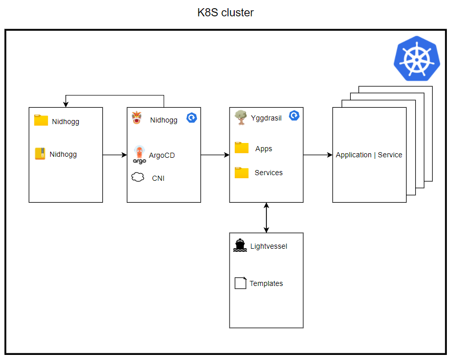

# Deploy the platform for development on Azure
You can create a development environment that uses Yggdrasil. This development environment will consist of 3 nodes and 3 storage nodes that together form an AKS cluster.
When clicking the deployment button, you will be redirected to Azure. Here, you will have to configure the deployment the way you would like. Most settings are preconfigured with values that are standard. However, you have to fill in the resource group you would like for the resource to be created in. 

[](https://portal.azure.com/#create/Microsoft.Template/uri/https%3A%2F%2Fraw.githubusercontent.com%2Fdistributed-technologies%2Fyggdrasil%2Faks-cluster%2Farm-templates%2Ftemplate.json)

When the resource creation finishes, you can choose to either use the shell in Azure found in the top right corner where the terminal icon is, or if you would like to authenticate to the cluster from your local development machine. We recommend authenticating from your own machine. A prerequisite to do this is the Azure CLI. You can find information on how to install that [here](https://docs.microsoft.com/en-us/cli/azure/install-azure-cli). When you have installed the Azure CLI, you can use the following command to authenticate to the AKS cluster: 
```
az aks get-credentials --resource-group <YOUR-RESOURCE-GROUP-NAME> --name <YOUR-RESOURCE-NAME>
```

This should allow you to see the Kubernetes nodes by typing:
```
kubectl get nodes
```
You now have access to your new Kubernetes development environment. The next thing we need to do is deploy the SCCP platform onto the cluster. Since we are using AKS, it will not be the whole SCCP platform that will be deployed, but rather the top part of the stack, called Yggdrasil. 
To install Yggdrasil on the AKS cluster, you need to have Helm installed. A guide to install helm can be found [here](https://helm.sh/docs/intro/install/).

Once Helm has been installed, you need to clone the Yggdrasil repository and cd into it. 

```
git clone https://github.com/distributed-technologies/yggdrasil.git
cd yggdrasil/
```

To set any cluster configurations, you should edit the nidhogg/values.yaml file. Once you are satisfied with the configurations of the cluster, edit the yggdrasil/values.yaml file and enable the services that you would like to enable on the cluster. You should change the installCNI flag to "false" and change the enableCephAKS to "true". 
You are now ready to install Yggdrasil on the cluster by running the command: 

```
helm install --create-namespace -n yggdrasil nidhogg nidhogg/
```

The platform will now bootstrap onto the AKS cluster and you can follow this process by executing the command: 

```
watch kubectl get pods -A
```

Once the pods are all in a Running state, it is possible for you to gain access to the ArgoCD dashboard. In order to do so, you will need to change the service to a type Loadbalancer and you will need to extract the password from the secret inside the cluster. 

The default user is "admin". To extract the password, run:

```
kubectl -n yggdrasil get secret argocd-initial-admin-secret -o jsonpath="{.data.password}" | base64 -d
```

Once you have the password, you need to change the service to a loadbalancer and let Azure create a loadbalancer for you. This will create a public IP, which you can use to access the ArgoCD dashboard. Run the command: 

```
kubectl patch svc nidhogg-argocd-server -n yggdrasil -p '{"spec": {"type": "LoadBalancer"}}'
```

To find the public IP of the loadbalancer, run: 

```
kubectl get svc -n yggdrasil
```
Here, you should see the service called nidhogg-argocd-server and be able to see a public IP that you can access from your browser and login with the username and password. 

# Changes in 2.0.0
In this version we have done the following changes: 
- Removed project definition from config.yaml and put it into its own file. This has been done because we are seeing a need to use all the configurations an argo project gives us, not just the limited subset that we had first configured. 
- Added networkPolicy and resourceQuota definitions for namespaces

### Upgrading from 1.x.x to 2.0.0
In order to upgrade from the previous version, you need to delete the project definition from your config.yaml in all your namespaces. These project definitions should then be added as a file on the same path as the config.yaml but be called project.yaml instead. This file can only contain the spec part of the project manifest, which can be found [here](https://argo-cd.readthedocs.io/en/latest/operator-manual/project.yaml): 

# Yggdrasil
This is the repository for the cluster environment. It contains two Helm charts called Nidhogg and Yggdrasil.

## Principles
When deciding on a workflow for deploying new applications and maintaining running applications on the cluster, we have adopted some of the principles from [GitOps](https://www.gitops.tech/). These principles will be defined in the following sections.

### Application repository
The application repository contains the source code of the application and the deployment manifests to deploy the application.

### Environment repository
The environment repository contains all deployment manifests of the currently desired infrastructure of an deployment environment. It describes what applications and infrastructural services should run with what configuration and version in the deployment environment.

### Yggdrasil
The cluster environment repository contains the configurations for each application on the cluster. It describes the names, namespaces, sources and destinations of any application that is running on the cluster.

### Application and service
Services that run on the cluster are the applications that are needed for cluster maintenance. This is for example Prometheus and Ceph. Applications refer to 3rd party applications or applications developed by distributed technologies and could refer to data science projects.

## Charts in Yggdrasil
This section describes the two charts found in Yggdrasil, Nidhogg and Yggdrasil.

### Nidhogg
Nidhogg is the first Helm chart to be installed and it bootstraps all the applications in our cluster. The Nidhogg chart has a single dependency which is on the Nidhogg release from [this repository](https://github.com/distributed-technologies/nidhogg). Contained in this Nidhogg release is two dependencies: ArgoCD and a CNI(container network interface). The CNI can be disabled by default in case your cluster already has a CNI. The chart also contains a reference to Yggdrasil. This will deploy everything within the Yggdrasil chart.
This is illustrated in the following image.


As stated, Nidhogg also contains a reference to Yggdrasil, which will be deployed onto the cluster. Yggdrasil is the chart that holds references to all the applications and services that will be deployed onto the cluster. This deployment happens automatically when Nidhogg and ArgoCD are deployed.

### Lightvessel
Lightvessel is a repository that holds all the templates necessary to deploy services and applications on the cluster. This is templated into Yggdrasil with the `define`-block from Helm. It was decided to separate this code from Yggdrasil to lower the need for updating your own cloned or forked code. Instead, we will release versions of Lightvessel and getting the newest update is as easy as changing the version on the dependency in Yggdrasil. The current templates are:
- _application.yaml: Where the application is defined, a source provided and a target provided.
- _namespace.yaml: Where the namespace is defined.
- _project.yaml: Where the ArgoCD project is defined if the application should be in a project.
- _ingress.yaml: Where Ingress is specified.
- _resourceQuota.yaml: Where a limit is set on how many resources a namespace can use and request
- _networkPolicy: Where network policies can be set for namespaces

### Yggdrasil
Yggdrasil is the chart in which both developers and 3rd party developers will need to add their deployments into, to deploy them onto the cluster. Kubernetes manifests are generated using Helm templates from Lightvessel.

These templates will automatically generate new manifests when another application is created in Yggdrasil. This will be further elaborated in [How to add an application](#how-to-add-an-application).

In the next section, it will be described how to create your own cluster from this project.

# How to create your own cluster
Many of the design choices for Yggdrasil have been made to make it easier for internal and external organizations or developers to create their own cluster. Lightvessel and the Nidhogg release were made specifically so that there will rarely ever be a need to merge changes in from our version of Yggdrasil. The changes we make will be released in a Lightvessel or Nidhogg release and therefore it is only necessary to change the dependency version. This means that when you would like to create a new cluster, you can simply **clone** or **fork** this repository.

### Cluster specific values
The developers from Distributed Technologies at Energinet will not know your specific cluster details. Therefore, you have to define these yourself. Most of the cluster-specific values can be found and set in the file `nidhogg/values.yaml`. Included in these values is whether not to enable the CNI, the loadbalancer IPs and the IngressDomain. When these values have been set, you are now ready to [install the chart](#installing-chart).

In the next section, it will be described how to create the config and values file needed to deploy applications to the cluster.

# How to add an application
The workflow for deploying applications on the cluster is shown in the image below.


### Step one
The developers of either a 3rd party application or the maintainers of the cluster should create a new application reposity that contains the code for their app. When this code is committed, it should trigger a build pipeline that will update the artifact repository. After this, the environment repository will need to be either manually or automatically updates to reflect the new artifacts.

### Step two
Now that the application is created, the developers needs to create a pull request to Yggdrasil. Depending on if it is a service or an application, it should be in the correct folder. This pull request should add two files to a new folder in either the services or applications subdirectories. These files should be called config.yaml and <nameofapp>.yaml:

An example of the config.yaml is seen here:

``` yaml
name: <appName>
namespace: <namespace>
# Optional
# This determins the 'destination.server' and 'project.destination[0].server'
# If this is not set they will default to 'https://kubernetes.default.svc'
# If this is set - all apps in this config will be deployed to that server
# A namespace will not be made by the lightvessel template
# The syncOption createNamespace will be set to true
destinationServer: <server>
description: <description>
# Optional
# Global labels - these will be set on all apps in the config
# the label 'app: <appName>' is set by default
namespaceLabels: 
  label1: label1
labels:
  label1: label1

# This defines the applications that will be deployed.
# It is a list in cause you would like to deploy multiple applications
# to the same argocd project and namespace
apps:
  - name: <applicationName>
    # Optional
    # App specific labels - these will only be set on that app
    label:
      <label1>: <label>
    # Optional
    # Will generate a ingress resource
    # A list incase you need to have multiple ingerss resources for a app
    ingress:
      - <applicationName>:
          Annotation:
            traefik.ingress.kubernetes.io/router.entrypoints: <entrypoint>
          subDomain: <subdomain>
          path: <path>
          servicePort: <port>
          serviceName: <ServiceNameOfPrometheusService>
    source:
      repoURL: '<repoURL'
      # For a git repo the Standard targetRevision is HEAD
      # For a helm repo the targetRevision is the version of the chart you want
      targetRevision: <branch>
      # The path and chart key's cannot be used together
      # Path to Helm chart in git repo. Should be . if Helm chart is in root
      path: <path>
      # Incase the repoURL is a helm repo, you need to add this
      chart: <chartName>
      # Filename of values file that is local right next to this config.yaml file
      valuesFile: "<valuesFile>"
```

It is also possible to define a custom values file and place it in the same directory as the config.yaml. This values file should be named the same as the application it is providing the values for and then referenced in the config.yaml as you can see above. An example is given here:

```
name: <appName>
otherValue: <myValue>
project:
  indentedValue: <indentedValue>
```

# Defining a project
Next to the config.yaml file, every namespace should have a project definition. This is important because projects isolate namespaces and services from interfering with each other. 
A project definition could look like this: 
``` yaml
description: <name> Argo Project
sourceRepos:
- '*'
destinations:
- namespace: <namespace>
  server: https://kubernetes.default.svc
clusterResourceWhitelist:
- group: '*'
  kind: 'Deployment'
```
More options to configure the project can be found [here](https://argo-cd.readthedocs.io/en/latest/operator-manual/project.yaml). 

Contributors should also define a networkPolicy and a resourceQuota for your namespace. These files should be placed next to the config.yaml and be called network-policy.yaml and resource-quota.yaml. It is only possible to include the `spec` part of these resources. A typical network-policy could look like this: 
``` yaml
podSelector: {}
policyTypes:
- Ingress
- Egress
ingress:
- from: 
  - namespaceSelector: 
      matchLabels: 
        space: service
egress:
- to: 
  - namespaceSelector:
      matchLabels: 
        space: service
```

A typical resource-quota could look like this: 
``` yaml
hard:
  requests.cpu: "8"
  requests.memory: 20Gi
  limits.cpu: "16"
  limits.memory: 40Gi
```

Example of these can also be found throughout the yggdrasil/services folder. 

A PR will then need to be approved by the cluster development team, before it is merged into Yggdrasil. When this is merged, ArgoCD will automatically deploy the application onto the cluster.
When the deployment is done, ArgoCD will poll the environment repository every 3 minutes, to check for changes to the application.

## Installing chart
To install Yggdrasil, you first need to navigate to the nidhogg directory and run `helm dependency update`.
Then, from the root directory of Yggdrasil, run the command `helm install --create-namespace -n yggdrasil nidhogg ./nidhogg`.

## Testing using kind

Create a kubernetes cluster using kind.

    kind create cluster --config ./test/kind.yaml

Install the nidhogg chart, which will bootstrap the rest of the process

    helm install --create-namespace -n yggdrasil nidhogg ./nidhogg

To see the argo, open the browser to [argo web gui](https://localhost:30080).

To remove the cluster after test use kind delete

    kind delete cluster
